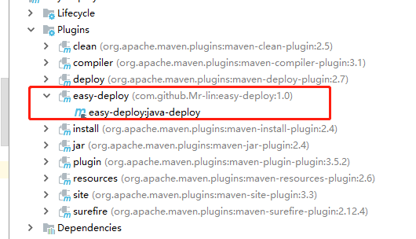

# maven远程部署插件

## 说明
通过shh 打包本地项目并发布到远程服务器，支持远程查看启动日志

## 引入

maven pom.xml 中引入

```xml
<build>
<plugin>
    <groupId>com.github.Mr-lin</groupId>
    <artifactId>easy-deploy</artifactId>
    <version>1.0.2</version>
    <configuration>
        <host>192.168.1.1</host>
        <user>user</user>
        <password>password</password>
        <remoteDeployDir>/home/projects/test</remoteDeployDir>
        <deployScript>/home/projects/test/start.sh</deployScript>
        <logPath>/home/projects/test/log/log.log</logPath>
    </configuration>
</plugin>
</build>

```

host 远程地址 user 账号 password 密码 remoteDeployDir 远程部署的路径 deployScript 路径下的部署脚本 logPath 日志路径

## 使用
先将项目编译打包好，然后执行plugins下的easy-deploy



或者直接项目路径下执行命令
```bash
mvn clean package -Dmaven.test.skip=true com.github.Mr-lin:easy-deploy:版本号:java-deploy
```

## [demo](https://github.com/Mr-lin/easydeploydemo)