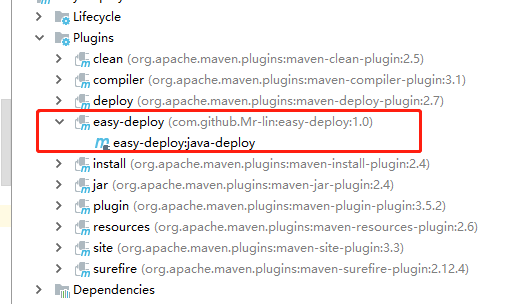

# maven远程部署插件

## 说明
通过shh 打包本地项目并发布到远程服务器，支持远程查看启动日志

## 引入

maven pom.xml 中引入

```xml
<build>
<plugin>
    <groupId>com.github.mrlin</groupId>
    <artifactId>easy-deploy</artifactId>
    <version>1.0</version>
    <configuration>
        <host>192.168.1.1</host>
        <user>user</user>
        <password>password</password>
      <targetDir>${project.build.directory}\${project.build.finalName}.${pom.packaging}		</targetDir>
        <targetName>${project.build.finalName}.${pom.packaging}</targetName>
        <remoteDeployDir>/home/projects/test</remoteDeployDir>
        <deployScript>start.sh</deployScript>
        <logPath>/home/projects/test/log/log.log</logPath>
    </configuration>
</plugin>
</build>

```

host 远程地址 user 账号 password 密码 remoteDeployDir 远程部署的路径 deployScript 路径下的部署脚本 logPath 日志路径

## 使用

